# spring-boot-microservices-course

spring-boot-microservices-course

# Database Configuration IN THE .PROPERTIES FILE  #
  
- spring.datasource.url=${DB_URL:jdbc:postgresql://localhost:15432/postgres}
- spring.datasource.username=${DB_USERNAME:postgres}
- spring.datasource.password=${DB_PASSWORD:postgres}
-
- These properties are only required for local debugging (e.g., hitting REST endpoints).
- They are NOT needed for code formatting, unit tests, or integration tests.
-
- Testcontainers automatically use the default credentials defined in infra.yml to
- connect the application to the database during local runs or debugging.
-
- Verified: Unit and integration tests do not require these properties,
- as the Spring Boot context does not load these configurations during the test phase.

# Pakaging type of java code
 


# Rules for Migration
- if we have put some **SQL** in the migration file and in the latter satge if 
- we want to **change anything** into that it will not work because it will make 
- the migration to fail due to the **checksum** value validation.


# Is it a good approach that tests and dev use different DBs?

- Yes — this is the intended, recommended approach in most projects:
- Tests: isolated, ephemeral DBs (Testcontainers) → deterministic CI, no test pollution.
- Dev: persistent DB (docker-compose) → you can inspect data, iterate, debug.
- Mixing them is risky: tests should be fully isolated from dev data.


### Your ContainersConfig (the PostgreSQLContainer bean annotated with @ServiceConnection) is what makes the tests start and use a Testcontainers PostgreSQL instance (DB name test, random host port like 1339). The task test flow runs mvn clean verify (tests), which does not run your start_infra task, so the docker-compose DB (catalog-db on host port 15432, DB postgres) is not used by tests. When you run the app from IntelliJ the app uses your normal dev config (docker-compose DB on 15432) and therefore sees the persistent schema — Flyway skips migrations.

-@TestConfiguration(proxyBeanMethods = false)
-public class ContainersConfig {
-   @Bean
-   @ServiceConnection
-   PostgreSQLContainer<?> postgresContainer() {
- return new PostgreSQLContainer<>(DockerImageName.parse("postgres:16-alpine"));
-    }
-   }
### The @ServiceConnection marker (Spring Boot Testcontainers integration) tells Spring Boot: “this is a service container; please wire application service connections (like the DataSource) to it.”

- Result: Spring Boot test autoconfiguration will use that container’s JDBC URL/credentials for the test DataSource. Testcontainers will create an ephemeral database (default databaseName is test) and expose it on a random host port (your logs show jdbc:postgresql://localhost:1339/test).

### Your **task test** command only runs Maven tests:

- test:
- deps: [format]
- cmds:
- - "{{.MVN}} clean verify"


- It does not call start_infra. So the docker-compose DB (which your dev run uses) is not started/used by the tests.

- Therefore tests create their own ephemeral DB via Testcontainers — fresh schema each run → Flyway runs all migrations.


# Final recommendations (what I’d do as a Java architect)

- Keep Testcontainers for tests (isolation + CI friendliness). Don’t try to point tests to your dev DB.

- Use docker-compose for local dev (persisted DB on 15432) so you can inspect and iterate.

- If you need tests to be faster, consider shared container reuse (local-only) or reduce the amount of migrations in the test profile (e.g., a V1__test_data.sql small set).

- If you want tests to occasionally use the persistent DB, do it explicitly via a separate profile and a CI/dev task that starts infra first — but keep that separate from your normal mvn test flow.


  


| Test                                  | Annotation / Tooling                                        | Server started? | DB real?                    |     Speed | Use case                                        |
| ------------------------------------- | ----------------------------------------------------------- | --------------- | --------------------------- | --------: | ----------------------------------------------- |
| Controller slice                      | `@WebMvcTest` + `MockMvc`                                   | No              | No (mock)                   | Very fast | Controller routing, validation, serialization   |
| Controller slice (RestAssuredMockMvc) | `RestAssuredMockMvc`                                        | No              | No                          | Very fast | Same as above, DSL style                        |
| Integration (full)                    | `@SpringBootTest(webEnvironment=RANDOM_PORT)` + RestAssured | Yes             | Optional (Testcontainers)   |      Slow | Full-stack verification (filters, security, DB) |
| Repository slice                      | `@DataJpaTest`                                              | No              | Optional via Testcontainers |    Medium | JPA mapping, custom repo queries                |
| Integration (HTTP)                    | `TestRestTemplate` or `HttpClient`                          | Yes             | Optional                    |      Slow | End-to-end HTTP flows                           |


| Aspect                                   | Pros                                                    | Cons                                                 |
| ---------------------------------------- | ------------------------------------------------------- | ---------------------------------------------------- |
| **`@TestConfiguration`**                 | Limits bean scope to tests, keeps prod context clean    | Needs explicit `@Import` if outside test package     |
| **`@Bean`**                              | Simple bean registration                                | Can conflict if multiple same-type beans exist       |
| **`@ServiceConnection`**                 | Auto-integration of Testcontainers (no manual registry) | Requires Spring Boot 3.1+                            |
| **Compared to `@DynamicPropertySource`** | Cleaner, automatic wiring                               | Less fine-grained control (if you need custom props) |


## 🏁 TL;DR

- What happens when your test starts:

- Spring loads ContainersConfig.

- It sees a @Bean returning a PostgreSQLContainer with @ServiceConnection.

- Boot automatically:

- starts the Postgres container;

- sets spring.datasource.* properties from it;

- creates your datasource connected to that container.

- Your tests run using the real Postgres DB in Docker, zero manual config.


| Scenario                                                                         | Recommended Tool               | Why                                          |
| -------------------------------------------------------------------------------- | ------------------------------ | -------------------------------------------- |
| You want to **test only your service logic** and isolate from external calls     | ✅ Mockito / @MockBean          | Fast, no network calls                       |
| You want to **simulate an HTTP-based external service** with realistic responses | ✅ WireMock                     | Simulates a fake server; great for REST APIs |
| You want to **test real integration between microservices**                      | ✅ Testcontainers + RestAssured | Runs real containers or endpoints            |


| Tool                                   | Layer / Use Case        | Description                                                                       | Pros                        | Cons                           |
| -------------------------------------- | ----------------------- | --------------------------------------------------------------------------------- | --------------------------- | ------------------------------ |
| **MockMvc (@WebMvcTest)**              | Controller (slice test) | Tests MVC layer only (controllers, mapping, validation). Services & Repos mocked. | Fast, no full context       | Doesn’t hit real DB or network |
| **TestRestTemplate (@SpringBootTest)** | Full app test           | Starts real app (embedded server) and sends HTTP calls                            | Built-in, simple            | Verbose, less expressive       |
| **RestAssured (@SpringBootTest)**      | Full app test           | DSL for readable HTTP tests                                                       | Fluent, powerful assertions | Slight learning curve          |
| **HttpClient (Apache)**                | Low-level network       | Used rarely in tests                                                              | Flexible                    | Verbose, manual setup          |


| Situation                   | Recommended                          |
| --------------------------- | ------------------------------------ |
| Testing controllers (no DB) | `@WebMvcTest + MockMvc`              |
| Testing service + DB + API  | `@SpringBootTest + RestAssured`      |
| Simple end-to-end sanity    | `@SpringBootTest + TestRestTemplate` |
| External API mocking        | WireMock                             |


### Container Optimization for Tests
✅ When
- Large DBs or services make tests slow.


# 10) Quick checklist / rules of thumb

1. Want fast runs and can share DB state? Use shared container + rollback or cleanup → fewer starts.

1. Want fully isolated tests with clean DB each time? Use fresh containers per test or per-class (slower).

1. Use static @Container for per-JVM start (fast across classes).

1. Use .withReuse(true) for local dev speed; don’t enable in CI unless you understand implications.

1. Always prefer Flyway for schema and base migrations — versioned and production-like.

1. Unit tests: never use DB — use builders, mocks, and resource fixtures.


| Concept       | Implementation Type                    | Used For                                    | Typical Scope                 | Example                    | Replaces / Simulates                  |
| ------------- | -------------------------------------- | ------------------------------------------- | ----------------------------- | -------------------------- | ------------------------------------- |
| **Fake Bean** | Real class implementing same interface | Simulate internal service with simple logic | Integration / component tests | `FakePaymentService`       | Internal app service beans            |
| **@MockBean** | Mockito proxy created by Spring        | Replace bean with mock for unit isolation   | Unit / slice tests            | `@MockBean PaymentService` | Internal beans (but no real behavior) |
| **WireMock**  | Local HTTP server                      | Simulate 3rd-party API responses            | Integration / end-to-end      | `stubFor(get("/users"))`   | External REST services                |

# 1. SPRING BOOT APPLICATION — LIFECYCLE EXPLAINED SIMPLY

| Step | Stage                             | What Happens                                                                                      | How It Works Internally (simplified but interview-worthy)                                                                              |
| ---- | --------------------------------- | ------------------------------------------------------------------------------------------------- | -------------------------------------------------------------------------------------------------------------------------------------- |
| 1    | **Start Application**             | You run `SpringApplication.run(MyApp.class, args)`                                                | It creates a `SpringApplication` object and prepares the environment (profiles, properties, etc.)                                      |
| 2    | **Create Environment**            | Loads configs from `application.properties`, YAML, system vars, etc.                              | Uses `ConfigFileApplicationListener` to load files, merges profiles, etc.                                                              |
| 3    | **Create Application Context**    | Spring creates an `ApplicationContext` (like a container holding all beans)                       | For Boot apps, typically `AnnotationConfigServletWebServerApplicationContext` (web) or `AnnotationConfigApplicationContext` (non-web)  |
| 4    | **Class Scanning**                | Scans packages starting from your main class’s package (due to `@SpringBootApplication`)          | Internally uses `ClassPathScanningCandidateComponentProvider` to find all `@Component`, `@Service`, `@Repository`, `@Controller`, etc. |
| 5    | **Bean Definition Creation**      | Each found class becomes a **Bean Definition** (a plan, not yet an object)                        | Metadata stored about constructor, fields, dependencies, etc.                                                                          |
| 6    | **Bean Instantiation (Creation)** | Beans are created based on their definitions                                                      | Uses **reflection** to call constructors (no need to manually `new`)                                                                   |
| 7    | **Dependency Injection (Wiring)** | Spring injects other beans into fields/constructors marked with `@Autowired`, `@Inject`, etc.     | Uses reflection again to set fields or call constructor parameters                                                                     |
| 8    | **Post Processing**               | Special beans like `BeanPostProcessor`, `@Configuration`, `@Transactional`, `@Aspect` are handled | Spring enhances beans using **CGLIB proxies** or **AOP** (reflection + dynamic proxy)                                                  |
| 9    | **Context Refresh / Ready**       | Once all beans are created and wired → context is ready                                           | `ApplicationContext.refresh()` triggers all initialization listeners                                                                   |
| 10   | **Run Application**               | If you have `CommandLineRunner` or web app → starts Tomcat or Jetty                               | Web server started, endpoints exposed                                                                                                  |
| 11   | **Application Running**           | You can now call APIs, etc.                                                                       | Context stays alive until shutdown                                                                                                     |
| 12   | **Shutdown / Destroy Beans**      | When app stops, Spring calls `@PreDestroy` / `DisposableBean` methods                             | Gracefully destroys beans and releases resources                                                                                       |


# 2. SPRING BOOT TEST APPLICATION — LIFECYCLE

| Step | Stage                                | What Happens                                                                       | Difference from Normal App                              |
| ---- | ------------------------------------ | ---------------------------------------------------------------------------------- | ------------------------------------------------------- |
| 1    | **Test Runner Starts**               | JUnit or other test framework starts                                               | Uses `SpringRunner` or `SpringExtension`                |
| 2    | **Create Test Context**              | A special **TestApplicationContext** is created                                    | Managed by `Spring TestContext Framework`               |
| 3    | **Load Configuration**               | Reads your `@SpringBootTest(classes=...)`, `@TestConfiguration`, etc.              | Allows overriding beans for tests                       |
| 4    | **MockBeans Registered**             | Beans annotated with `@MockBean` or `@SpyBean` are created and injected            | Uses Mockito under the hood, replaces real beans        |
| 5    | **ApplicationContext Reuse**         | If another test uses same context config, it **reuses it** (cached)                | Huge speed optimization — doesn’t rebuild every time    |
| 6    | **Bean Scanning & Creation**         | Same scanning, but may **limit scope** (`@WebMvcTest` only loads controller layer) | Avoids loading DB, services, etc. unless mocked         |
| 7    | **Dependency Injection**             | Injects mocks and real beans as per need                                           | Reflection + same injection process                     |
| 8    | **Start Web Environment (Optional)** | If `webEnvironment` set, embedded server may start                                 | Often mocked unless you use full integration test       |
| 9    | **Run Tests**                        | Your test methods execute                                                          | Context already loaded; tests can call beans, endpoints |
| 10   | **Tear Down / Reuse**                | Context may be reused for next test with same config                               | Otherwise destroyed                                     |

# 3. KEY DIFFERENCES (TABLE SUMMARY)
| Feature / Phase          | Spring Boot App                                | Spring Boot Test App                          |
| ------------------------ | ---------------------------------------------- | --------------------------------------------- |
| **Entry Point**          | `main()` method with `SpringApplication.run()` | `@SpringBootTest` + JUnit runner              |
| **Context Type**         | `ApplicationContext` (for runtime)             | `TestApplicationContext` (for testing)        |
| **Bean Scanning**        | Full package scanning                          | Can be filtered (`@WebMvcTest`, etc.)         |
| **Dependency Injection** | Normal beans                                   | Can use `@MockBean`, `@SpyBean`, test configs |
| **Reflection Usage**     | Create + inject beans                          | Same, but also injects mock proxies           |
| **Environment**          | `application.properties` or YAML               | Merged with `application-test.properties`     |
| **Startup Time**         | Normal                                         | Cached/reused to be faster                    |
| **Server**               | Always starts (if web)                         | Optional or mock server                       |
| **Context Reuse**        | No reuse                                       | Yes (to speed up tests)                       |
| **End Goal**             | Run app for users                              | Test behavior of beans or controllers         |


# when to use what in Testing

| Scenario                 | Library                          | Example                                                 |
| ------------------------ | -------------------------------- | ------------------------------------------------------- |
| Validate simple logic    | **JUnit + AssertJ**              | `assertThat(sum).isEqualTo(5)`                          |
| Mock dependencies        | **Mockito**                      | `when(repo.find()).thenReturn(...)`                     |
| Verify service behavior  | **Mockito + AssertJ**            | `verify(repo).findByCode("P100")`                       |
| Test controller endpoint | **MockMvc + AssertJ/JSONAssert** | `mockMvc.perform(...).andExpect(status().isOk())`       |
| Full integration (DB)    | **Testcontainers + AssertJ**     | Real Postgres, `assertThat(repo.count()).isEqualTo(10)` |
| Async events             | **Awaitility + AssertJ**         | `await().untilAsserted(...);`                           |
| External API testing     | **RestAssured**                  | `given().get(...).then().statusCode(200)`               |

# RabbitMQ Summary

## 1. What RabbitMQ is

RabbitMQ is a **message broker** – a software that allows applications to communicate asynchronously by sending messages through queues.

* Implements the **AMQP (Advanced Message Queuing Protocol)** standard.
* Decouples applications: producers send messages, consumers receive them later.

## 2. Core Concepts

* **Producer:** The application or service that sends messages.
* **Queue:** A storage buffer where messages wait until consumed.
* **Consumer:** The application that retrieves and processes messages.
* **Exchange:** Routes messages from producers to queues based on rules (**bindings**).

### Types of Exchanges

* **Direct:** Routes messages to queues with exact matching routing keys.

* **Fanout:** Broadcasts messages to all bound queues.

* **Topic:** Routes messages based on pattern-matching routing keys.

* **Headers:** Routes based on message headers instead of routing keys.

* **Binding:** A rule that links an exchange to a queue.

* **Routing Key:** A label used by exchanges to route messages to queues.

## 3. How it Works

1. Producer sends a message to an exchange.
2. Exchange routes the message to one or more queues using bindings.
3. Consumer reads the message from the queue.
4. Messages can be acknowledged to ensure delivery reliability.

## 4. Key Features

* **Reliability:** Durable queues, persistent messages, and acknowledgments.
* **Scalability:** Can cluster RabbitMQ servers for high availability.
* **Flexible routing:** Multiple exchange types allow different messaging patterns.
* **Supports multiple protocols:** AMQP, MQTT, STOMP, etc.
* **Plugins:** For monitoring, management UI, federation, and more.

## 5. Use Cases

* **Asynchronous processing:** Offloading tasks to workers.
* **Microservices communication:** Decoupling service interactions.
* **Event-driven architecture:** Broadcasting events to multiple services.
* **Task scheduling:** Delaying tasks or retries.

## 6. Pros

* Reliable and widely adopted.
* Mature ecosystem with good documentation.
* Flexible routing and patterns.
* Supports clustering and high availability.

## 7. Cons

* Can add operational complexity.
* Performance may be lower than simpler brokers for very high-throughput cases.
* Requires management of connections, queues, and exchanges.

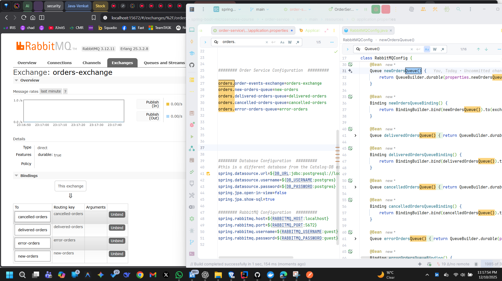
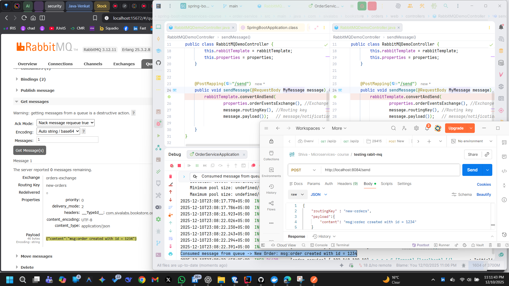
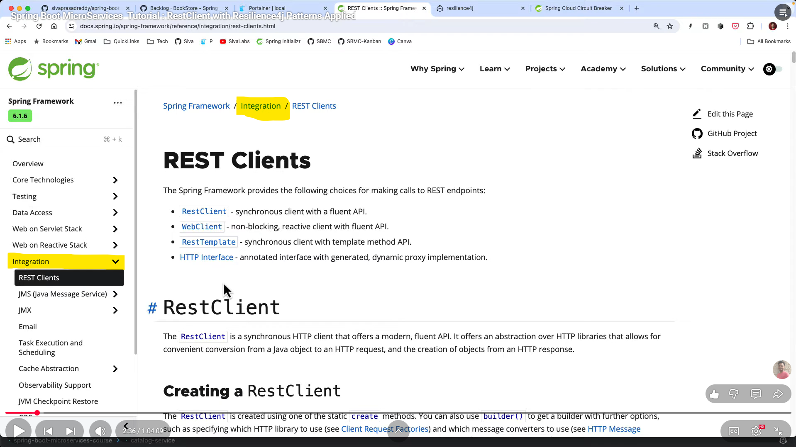
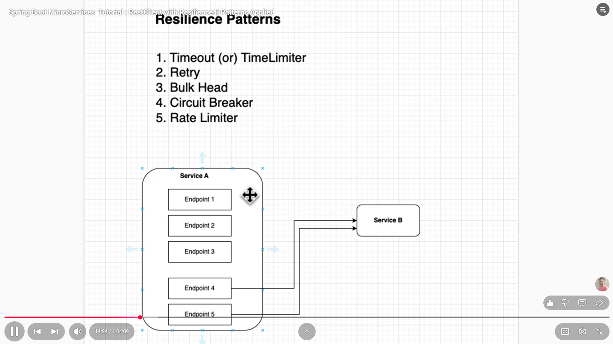
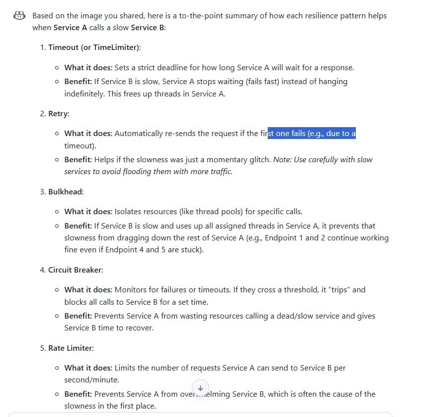

### two/three??? times i call from postman and its circuit become ***open*** for each call there are two retry in the backend
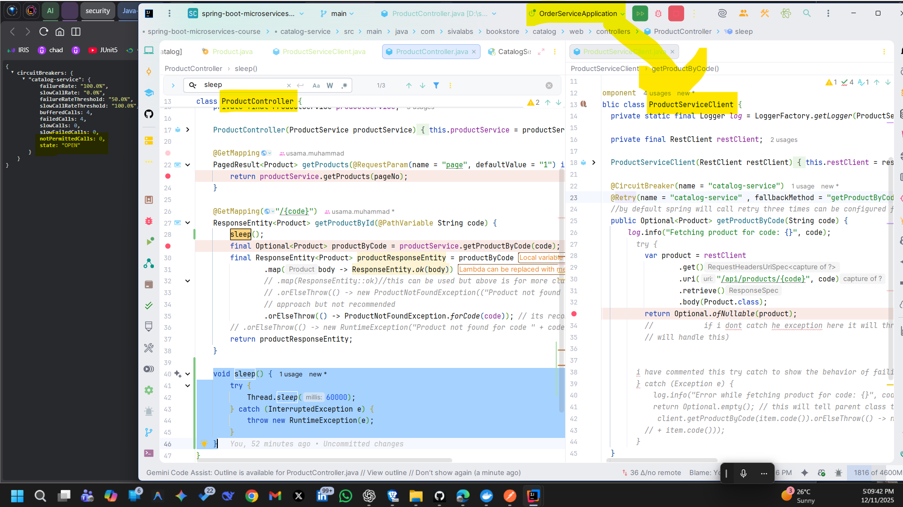
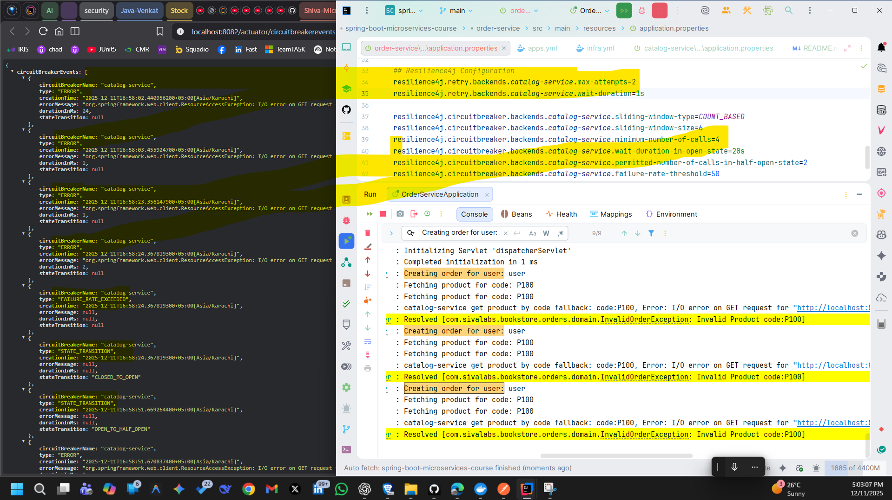

###outBox Pattren when interecting with external systems through quees use thsi pattren and save the message/event into the DB first before direcly sending it into the quee

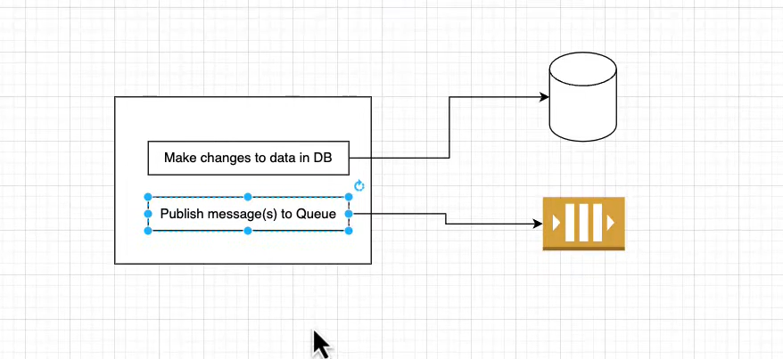

## use this way so that we can have a consistent stage regarding to save the data into the db and publich the event in 
## a trabsactional way and then use a schedule job with the retry mechanism to 
## consistently sending the message and with the feature of removing/reading duplicate messaegs from the same queee
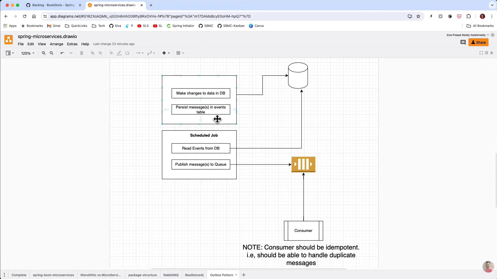
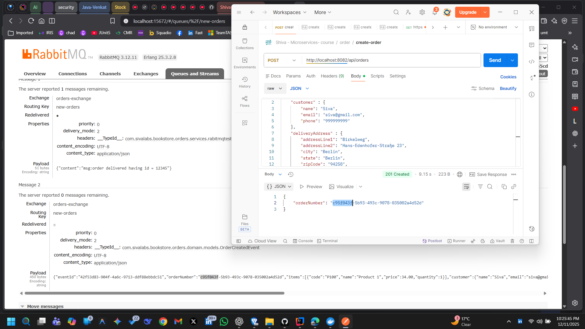

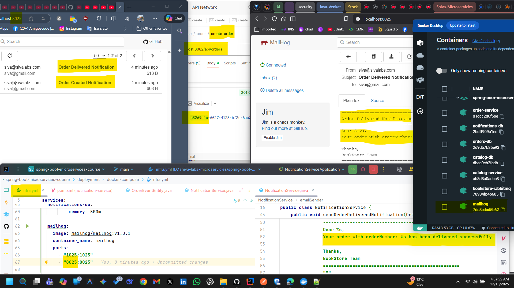
## creating duplicate event/Notification for testing from rabbit MQ, so we can make sure we are not sending the
duplicate notifications to the customer
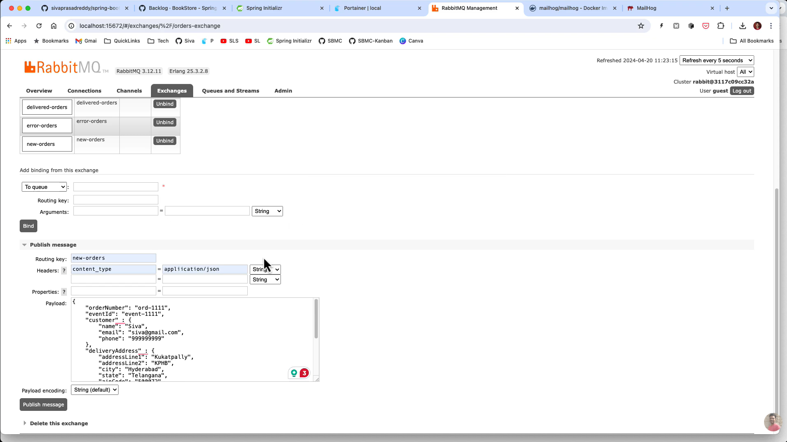

### Api Gateway 
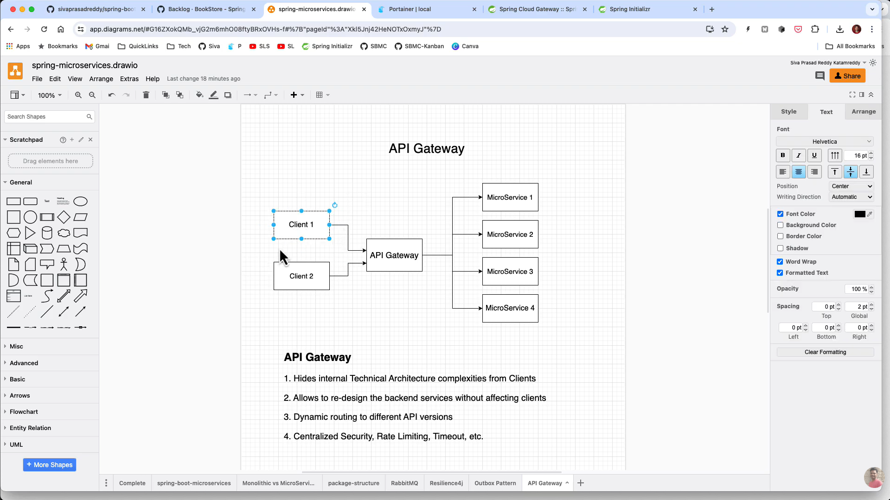

# Cross-Origin Resource Sharing (CORS)

## What Is CORS?

### **Simpler Explanation**
CORS, or **Cross-Origin Resource Sharing**, is a mechanism browsers use to ensure security when a web application makes requests to a server **not under the same domain**.

Imagine this:
1. You visit `myapp.com`.
2. `myapp.com` wants to fetch data from another server, `otherservice.com`, to display something (like product information).
3. Because the request is **cross-origin** (from one domain to another), the browser blocks it **by default** as a security measure. The server (`otherservice.com`) has to explicitly allow it by sending back special headers, like:
   ```http
   Access-Control-Allow-Origin: myapp.com
   ```

This ensures **malicious websites** cannot hijack your browser and access restricted APIs without permission.

---

### **Same-Origin vs Cross-Origin**
1. **Same-Origin Request**:
   - When both the requesting website (`myapp.com`) and the server are hosted under the **same domain**.
   - The browser allows the request without restrictions.
   - **Example:** A web app hosted at `myapp.com` fetching from `myapp.com`.

2. **Cross-Origin Request**:
   - When the requesting website (`myapp.com`) wants to fetch data from another domain (`otherservice.com`).
   - The browser blocks these requests unless the server explicitly allows them via **CORS headers**.

---

## Is CORS Required in Microservices?

### **Browser-to-Gateway Communication**
If a browser (or Swagger documentation, which acts like a browser) interacts with the API Gateway, this happens between different domains (e.g., a frontend running on `frontend.myapp.com` accessing `gateway.myapp.com`):
- **CORS Is Required.**
- The gateway must explicitly allow the browser’s domain via CORS headers.

---

### **Gateway-to-Service Communication**
The API Gateway forwards requests to backend services like Order Service or Catalog Service. Since this communication is internal between servers:
- **CORS Is Not Required.**
- These requests don’t go through a browser, so the same-origin policy doesn’t apply.

---

### **Service-to-Service Communication**
When one microservice (e.g., Order Service at `order.myapp.com`) calls another microservice (e.g., Catalog Service at `catalog.myapp.com`), it is also internal:
- **CORS Is Not Required.**

---

### **Scenario Example and Explanation**

Imagine the following setup:
1. **Browser → API Gateway**:
   - The browser or Swagger UI (which behaves as a browser) sends a request to the API Gateway at `gateway.myapp.com` on port `8080`.
   - Because the browser and gateway have **different origins**, CORS is required to allow communication.

   **Solution**:
   Add CORS headers to the API Gateway:
   ```http
   Access-Control-Allow-Origin: frontend.myapp.com
   Access-Control-Allow-Methods: GET, POST, PUT, DELETE
   ```

2. **API Gateway → Order Service**:
   - The API Gateway forwards the browser’s request to the Order Service at `order-service.myapp.com` on port `8081`.
   - Since this communication happens between servers (gateway and order service), no browser is involved.

   **CORS Is Not Required Here.**

3. **Order Service → Catalog Service**:
   - The Order Service fetches product details from the Catalog Service at `catalog-service.myapp.com` on port `8082`.
   - Again, this is server-to-server communication without browser involvement.

   **CORS Is Not Required Here.**

---

### **Does Swagger Documentation Require CORS?**

Yes, Swagger documentation behaves like a browser. If you host Swagger UI for APIs (e.g., at `api-docs.myapp.com`), it interacts with your backend APIs, which might be at different domains like:
- **Swagger → Gateway** (`api-docs.myapp.com → gateway.myapp.com`):
   - This is a cross-origin request, and CORS headers must be enabled on the API Gateway.
- **Swagger → Backend Service**:
   - If Swagger interacts directly with services like Order Service (`order-service.myapp.com`), each backend service needs to support CORS to allow Swagger requests.

---

## Workflow Recap with Microservices

1. **Browser Requests**:
   - For frontend or Swagger-based requests **to the API Gateway**, enable CORS in the Gateway configuration.

2. **Gateway Calls Services**:
   - Gateway forwards requests (to Order Service, Catalog Service). These are internal calls, so CORS isn’t required.

3. **Microservice-to-Microservice Calls**:
   - Internal service calls (Order → Catalog) don’t use CORS.

---

## CORS Configuration Example for Gateway

Use the following CORS configuration for Spring-based API Gateway:

### For Spring Boot Backend:
```java
import org.springframework.context.annotation.Bean;
import org.springframework.context.annotation.Configuration;
import org.springframework.web.servlet.config.annotation.CorsRegistry;
import org.springframework.web.servlet.config.annotation.WebMvcConfigurer;

@Configuration
public class GatewayCorsConfig {

    @Bean
    public WebMvcConfigurer corsConfigurer() {
        return new WebMvcConfigurer() {
            @Override
            public void addCorsMappings(CorsRegistry registry) {
                registry.addMapping("/**")
                        .allowedOrigins("http://frontend.myapp.com", "http://api-docs.myapp.com")
                        .allowedMethods("GET", "POST", "PUT", "DELETE");
            }
        };
    }
}
```

---

## Why Is This Important?

1. **Security**:
   - Browsers block unauthorized cross-origin requests by default. Proper CORS setup ensures only allowed domains can access your APIs.

2. **Compatibility**:
   - Tools like Swagger UI, frontend applications, or external integrations require CORS to work across domains.

3. **Internal Microservices**:
   - CORS is not needed for internal service-to-service communication, keeping configurations simpler.

---

## Conclusion

### Where CORS Is Required:
- **Browser-to-Gateway:** Required.
- **Swagger-to-Gateway:** Required.
- **Microservice-to-Microservice:** Not Required.

### CORS Flow for Microservices Architecture:
1. Enable CORS for Browser-to-Gateway and Swagger-to-Gateway communication.
2. Skip CORS for internal service-to-service communication.
3. Test Swagger implementation to ensure frontend/browser clients can access APIs via CORS properly!


### Why Is /etc/hosts Important in Microservices Development?
1. Local DNS Resolution:

   **Microservices often need communication over networked hostnames (e.g., catalog-service, order-service). Before querying DNS servers, the system checks /etc/hosts for mappings.
   **Docker Networking:

2. Docker uses custom entries in /etc/hosts to facilitate local container communication (e.g., Kubernetes). 

   **For example, the catalog-service entry allows api-gateway hosted locally to call catalog-service by hostname without external DNS queries.
   **Testing Services Locally:

You can map hostnames to localhost = 127.0.0.1 to test services like Keycloak, Kafka, or APIs locally.

# Use Case in Microservices

The `/etc/hosts` file helps resolve domain names to IP addresses locally without relying on external DNS. This file plays a vital role in microservices setups, especially during local testing or development with tools like Docker or Kubernetes.

---

## Use Cases in Microservices

### **1. Browser Sends Request to API Gateway**
When the browser sends requests to the **API Gateway**:
- **Host:** `api-gateway` (e.g., `http://localhost:8989`) routes the requests internally using the mappings in `/etc/hosts`.
- This ensures the browser can reach the gateway locally.

---

### **2. API Gateway Sends Request to Catalog Service**
The API Gateway forwards browser requests to the **Catalog Service**:
- **Host:** `catalog-service` resolves locally to `127.0.0.1`, as defined in `/etc/hosts`.
- This guarantees the API Gateway can communicate with the Catalog Service.

---

### **3. Service-to-Service Communication**
**Internal services** like the Order Service often need to call other tools, like:
- **Kafka**:
   - In this example, `kafka` is mapped to `127.0.0.1`.
   - The Order Service can resolve `kafka` locally using `/etc/hosts`.

---

### **4. Swagger or Frontend Requests**
**Swagger UI** or a frontend app sends requests to backend services:
- **Services:** Swagger or the browser interacts with various local services, such as:
   - `keycloak`
   - `catalog-service`
   - `api-gateway`

Using `/etc/hosts` mappings ensures that these services can be accessed locally without relying on DNS.

---

## Example /etc/hosts Configuration for Microservices
```plaintext
127.0.0.1 api-gateway
127.0.0.1 catalog-service
127.0.0.1 order-service
127.0.0.1 kafka
127.0.0.1 keycloak
```
This configuration maps services to the local machine (`127.0.0.1`) to enable seamless communication during development and testing.

---

## Key Benefits in Microservices Architecture
- **Local Resolution:** Enables services to communicate locally without external DNS dependency.
- **Frontend/API Testing:** Ensures the browser or Swagger can access services running on the local machine.
- **Internal Communication:** Supports microservices (e.g., Gateway → Catalog, Order → Kafka) communication within local environments.

---

Using the `/etc/hosts` file simplifies microservices networking during development and testing by resolving hostnames locally.

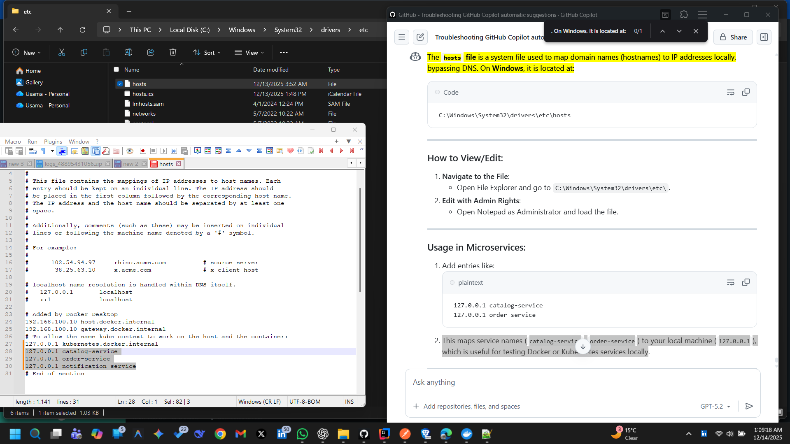


### if i don't add above (127.0.0.0 order-service)then if i run the some from the browser or swagger it will give error like this COROS error or DNS error because the browser or swagger is not able to resolve the order-service hostname to the localhost ip address

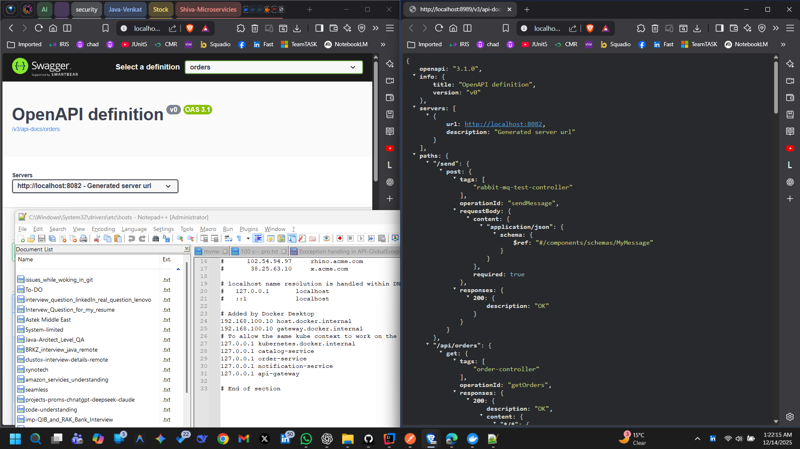

but if i add the above entry in the /etc/hosts file then it will be able to resolve the order-service hostname to the localhost ip address and it will be able to call the order-service from the browser or swagger without any error
and it changes the localhost to order-service hostname as we can see in the swagger documentation below image

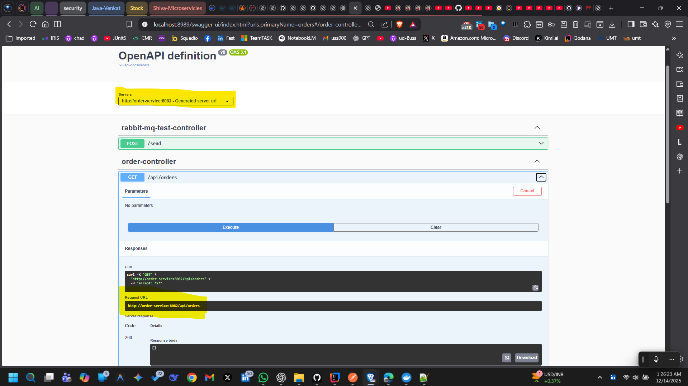
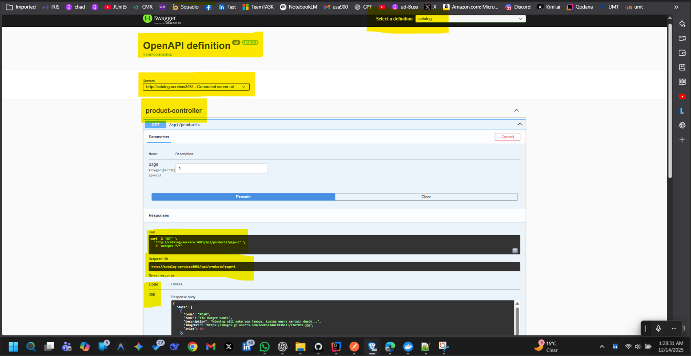


# Comparison of HTTP Client Methods in Microservices Development

Spring provides various approaches to make HTTP calls to external systems and other microservices. A new feature called **HTTP Declarative Interface** (`@HttpExchange`) simplifies the process by reducing boilerplate code, and there are other popular methods, such as **RestClient**, **RestTemplate**, **Feign Client**, and **WebClient**.

Here’s a concise comparison with their pros, cons, use cases, and recommendations for microservices development.

---

## **HTTP Declarative Interface**

### **Overview**
Introduced in **Spring Framework 6.1**, the HTTP Declarative Interface allows developers to define REST APIs via annotated interfaces, eliminating boilerplate code and the need for Feign.

### **Example Usage:**
```java
public interface CatalogServiceClient {

    @GetExchange("/catalog/api/products")
    PagedResult<Product> getProducts(@RequestParam int page);

    @GetExchange("/catalog/api/products/{code}")
    ResponseEntity<Product> getProductByCode(@PathVariable String code);
}
```
- **How It Works**: Spring generates proxies for the interface methods automatically, handling HTTP requests behind the scenes.

---

## **RestClient**

### **Overview**
A new modern HTTP client from Spring that offers flexibility for building synchronous and asynchronous requests programmatically.

### **Example Usage:**
```java
var product = restClient.get()
                .uri("/api/products/{code}", code)
                .retrieve()
                .body(Product.class);
```
- **How It Works**: Developers manually construct HTTP requests using a fluent API.

---

## **RestTemplate**

### **Overview**
A traditional synchronous HTTP client widely used in older Spring applications. It's simple but requires higher boilerplate for setup.

### **Example Usage:**
```java
RestTemplate restTemplate = new RestTemplate();
Product product = restTemplate.getForObject(
    "/api/products/{code}", Product.class, code);
```
- **How It Works**: Requires explicit configurations for headers, query parameters, etc.

---

## **Feign Client**

### **Overview**
A declarative HTTP client provided by Spring Cloud, allowing you to define REST API clients through interfaces.

### **Example Usage:**
```java
@FeignClient(name = "catalog-service", url = "http://localhost:8081")
public interface CatalogService {

    @GetMapping("/catalog/api/products")
    PagedResult<Product> getProducts(@RequestParam int page);

    @GetMapping("/catalog/api/products/{code}")
    ResponseEntity<Product> getProductByCode(@PathVariable String code);
}
```
- **How It Works**: Feign creates a proxy for the interface methods and executes HTTP calls.

---

## **WebClient**

### **Overview**
Designed for reactive programming and asynchronous HTTP calls. Ideal for streaming APIs or large-scale event-driven architectures.

### **Example Usage:**
```java
WebClient webClient = WebClient.create();
Product product = webClient.get()
    .uri("/api/products/{code}", code)
    .retrieve()
    .bodyToMono(Product.class)
    .block(); // For synchronous calls
```
- **How It Works**: Provides full control over request composition, headers, and payloads using reactive APIs.

---

## **Feature Comparison**

| **Feature**                        | **HTTP Declarative Interface**         | **RestClient**                     | **RestTemplate**                  | **Feign Client**                       | **WebClient**                   |
|------------------------------------|-----------------------------------------|-------------------------------------|------------------------------------|-----------------------------------------|----------------------------------|
| **Code Style**                     | Interface-driven, annotation-based      | Programmatic with fluent API        | Traditional blocking approach      | Interface-driven with external setup   | Reactive chaining approach      |
| **Boilerplate Reduction**          | High                                    | Moderate                            | Low                                | Moderate                                | Low                              |
| **Ease of Use/Readability**        | High (simple and organized)             | Moderate (clean with chaining)      | Moderate (traditional style)       | Moderate                                | Lower readability for reactive flows |
| **Dependency Requirement**         | None (built directly into Spring)       | None (native Spring support)        | None                                | Requires external library (`spring-cloud-starter-openfeign`) | None (native Spring WebFlux)    |
| **Reactive Capability**            | No                                      | Yes                                 | No                                 | No                                     | Yes                              |
| **Performance**                    | High (optimized via Spring proxies)     | High (supports asynchronous calls)  | Moderate (synchronous, blocking)   | Moderate                                | High                             |
| **Recommended for Microservices?** | Yes                                     | Yes                                 | No                                 | Limited                                | Only for reactive workloads     |

---

## **How HTTP Declarative Interface Removes Feign**
### **Simplifications**
1. **Built-In Spring Support**:
    - No need for external libraries like Feign (`spring-cloud-starter-openfeign`).
    - Fully integrated into **Spring Framework 6.1** and newer.

2. **Automatic Proxy Creation**:
    - Spring internally generates proxies using `HttpServiceProxyFactory`, eliminating manual setup (e.g., Feign dependency, `@EnableFeignClients`).

3. **Annotations-Driven**:
    - Uses Spring-native annotations (`@HttpExchange`, `@GetExchange`, etc.) instead of Feign-specific ones (`@FeignClient`, `@RequestMapping`).

4. **Dependency-Free**:
    - Feign requires external libraries, whereas HTTP Declarative Interface works out of the box with Spring.

---

## **Pros and Cons of Each Method**

| **Method**                  | **Pros**                                                                                   | **Cons**                                                                               |
|-----------------------------|--------------------------------------------------------------------------------------------|--------------------------------------------------------------------------------------|
| **HTTP Declarative Interface** | Reduces boilerplate, built-in, easy testing via mocks.                                    | Limited flexibility for highly dynamic or complex requests.                          |
| **RestClient**              | Simple, programmatic control, supports both sync/async requests.                           | Requires more boilerplate for advanced customizations.                              |
| **RestTemplate**            | Familiar and simple for legacy projects.                                                   | Blocking calls and higher boilerplate make it less suitable for modern applications. |
| **Feign Client**            | Declarative API client with flexible configuration.                                        | External dependency and setup required (`@EnableFeignClients`).                      |
| **WebClient**               | Ideal for reactive applications and streaming data.                                        | Higher learning curve for developers new to reactive programming.                    |

---

## **Recommendations for Microservices**

| **Scenario**                             | **Recommended Method**               |
|------------------------------------------|---------------------------------------|
| Simple and low-boilerplate API calls      | HTTP Declarative Interface            |
| Highly dynamic or complex request building| RestClient                            |
| Legacy applications using synchronous style| RestTemplate                          |
| Projects reliant on Spring Cloud setups  | Feign Client                          |
| Reactive APIs or streaming data           | WebClient                             |

---

## **Conclusion**
### **Most Recommended for Microservices**
The **HTTP Declarative Interface** is the preferred choice for designing microservices that call other microservices via REST APIs. It is:
- **Lightweight**: No external dependencies.
- **Simple**: Reduces boilerplate setup.
- **Integrated**: Native to Spring Framework.

For advanced use cases like reactive flows or complex dynamic requests, **RestClient** or **WebClient** should be considered.

### IN ORDER TO CALL THE EXTERNAL API/MICROSERVICE ONE WAY IS TO USE BELOW AS WE DID IN ORDER SERVICE CLIENT USING BELOW
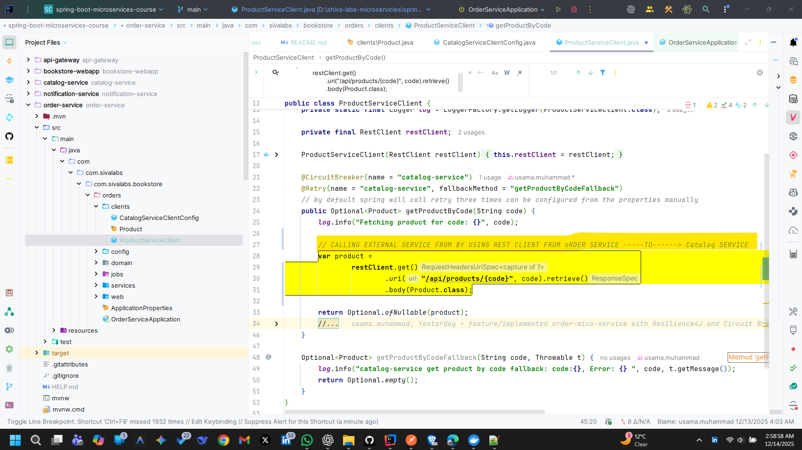


### BUT THERE IA A NEW APPROACH AVAILABLE CALLED hTTP dECLARATIVE INTERFACE THAT IS KIKE BELOW THSI WAT WE CAN REDUCE THE BOILLER PLATE CODE
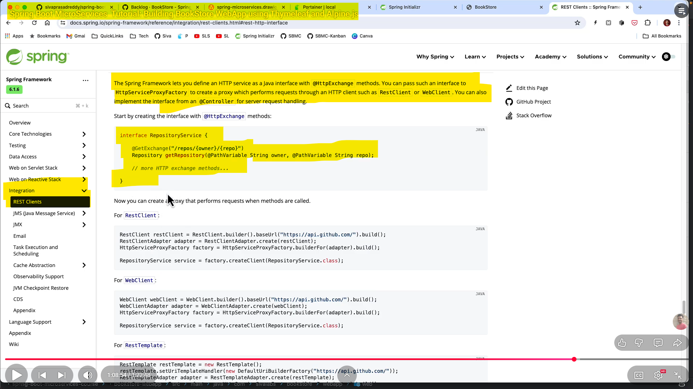


### before using the Declarative Client we need to call the rest apis like below form our fromtend JS code

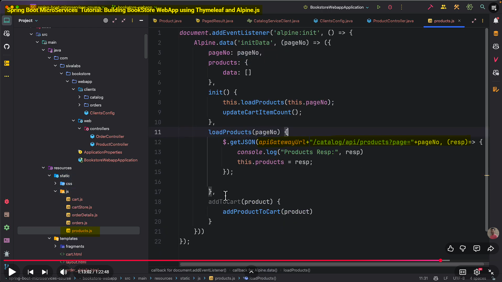

### But after the declarative code implementation we can do by doing below

## the implementation we need to do request from the js will going to hit this inernal controller of the bookstore and from there using the
## declarative Http Client a call rest call to  will be initiated to the downstream service(API Gateway in our case) so get the reposne and  make a more fine grainnned controll over the request
## the main idea and the benifir of this we can call one endpoint from the js and from out java code of bookstore we can call 
## multiple calls to different microservicies to make a agregated data in the boorstore service/controller by calling multiple http declarative apis call
## thsi way we can reduce the boiller plate code in js application

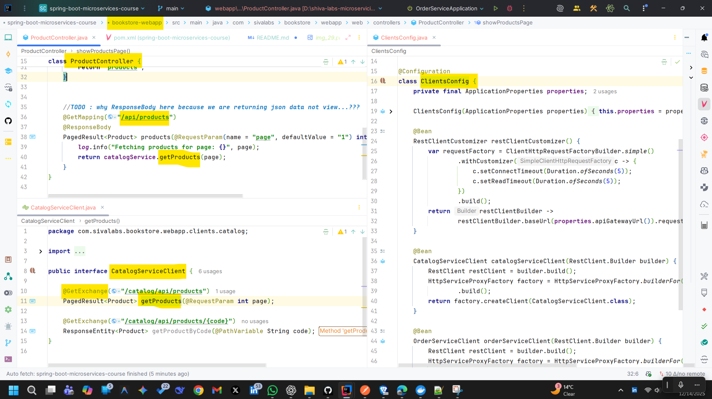
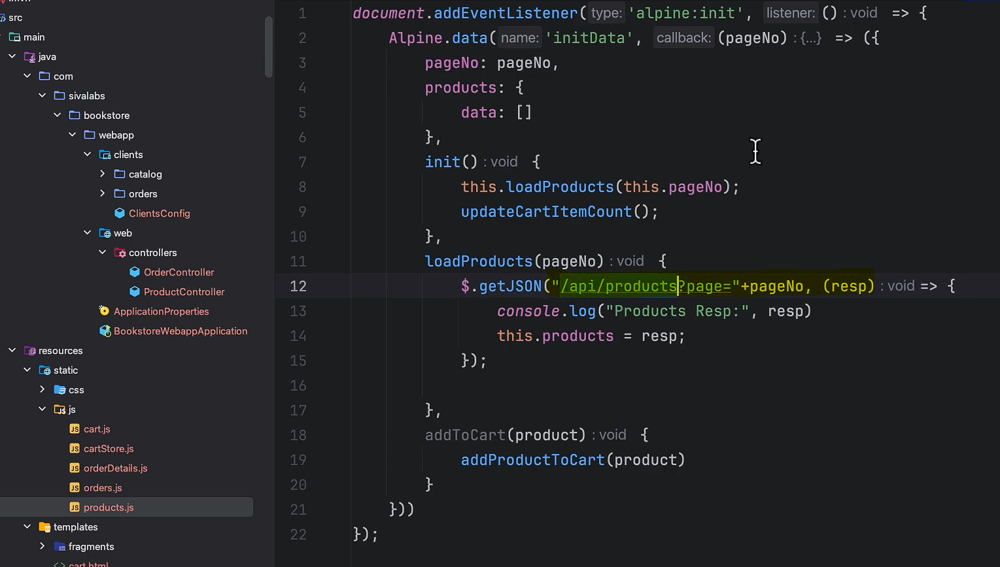


YOUR WINDOWS MACHINE                         DOCKER CONTAINERS
┌─────────────────────────────────────────────────────────────────────────────┐
│                                                                             │
│  Browser/Postman                           Docker Network                   │
│  ┌─────────────┐                          ┌─────────────────────────────┐   │
│  │             │                          │                             │   │
│  │ localhost:  │                          │  ┌─────────────────────┐    │   │
│  │   8083  ────┼──────────────────────────┼─►│  catalog-service    │    │   │
│  │             │         8083:8083        │  │  (port 8083)        │    │   │
│  │             │                          │  └──────────┬──────────┘    │   │
│  │             │                          │             │               │   │
│  │ localhost:   │                          │             │ catalog-db: 5432│  │
│  │   8084  ────┼──────────────────────────┼─►┌──────────▼──────────┐    │   │
│  │             │         8084:8084        │  │  order-service      │    │   │
│  │             │                          │  │  (port 8084)        │    │   │
│  │             │                          │  └──────────┬──────────┘    │   │
│  │             │                          │             │               │   │
│  │ localhost:  │                          │  ┌──────────▼──────────┐    │   │
│  │   15432 ────┼──────────────────────────┼─►│  catalog-db         │    │   │
│  │             │        15432:5432        │  │  (port 5432)        │    │   │
│  │             │                          │  └─────────────────────┘    │   │
│  │             │                          │                             │   │
│  │ localhost:  │                          │  ┌─────────────────────┐    │   │
│  │   25432 ────┼──────────────────────────┼─►│  orders-db          │    │   │
│  │             │        25432:5432        │  │  (port 5432)        │    │   │
│  │             │                          │  └─────────────────────┘    │   │
│  │             │                          │                             │   │
│  │ localhost:  │                          │  ┌─────────────────────┐    │   │
│  │   5672  ────┼──────────────────────────┼─►│  bookstore-rabbitmq │    │   │
│  │   15672 ────┼──────────────────────────┼─►│  (5672 & 15672)     │    │   │
│  │             │                          │  └─────────────────────┘    │   │
│  └─────────────┘                          └─────────────────────────────┘   │
│                                                                             │
└─────────────────────────────────────────────────────────────────────────────┘