# spring-boot-microservices-course

spring-boot-microservices-course

# Database Configuration IN THE .PROPERTIES FILE  #
  
- spring.datasource.url=${DB_URL:jdbc:postgresql://localhost:15432/postgres}
- spring.datasource.username=${DB_USERNAME:postgres}
- spring.datasource.password=${DB_PASSWORD:postgres}
-
- These properties are only required for local debugging (e.g., hitting REST endpoints).
- They are NOT needed for code formatting, unit tests, or integration tests.
-
- Testcontainers automatically use the default credentials defined in infra.yml to
- connect the application to the database during local runs or debugging.
-
- Verified: Unit and integration tests do not require these properties,
- as the Spring Boot context does not load these configurations during the test phase.

# Pakaging type of java code
 
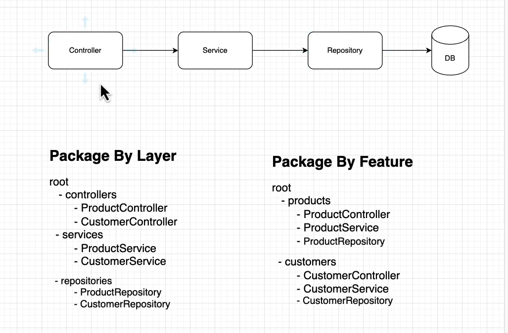
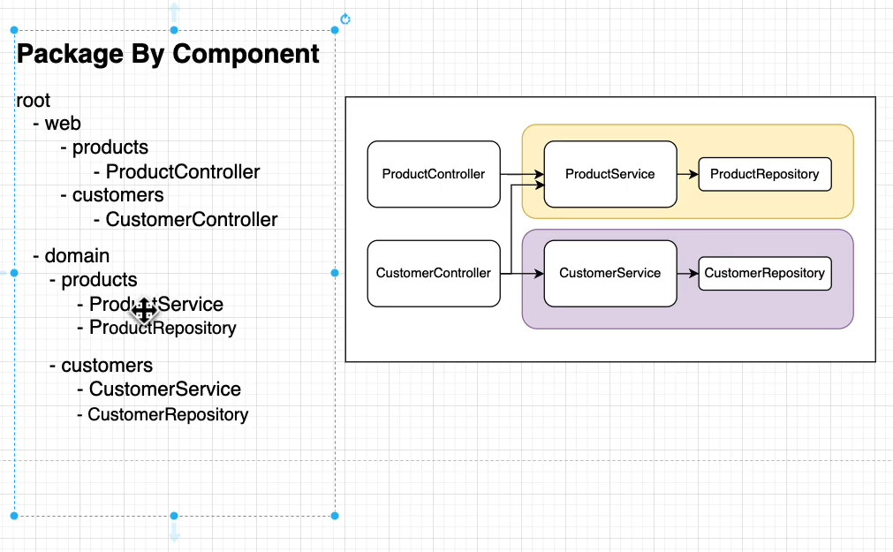

# Rules for Migration
- if we have put some **SQL** in the migration file and in the latter satge if 
- we want to **change anything** into that it will not work because it will make 
- the migration to fail due to the **checksum** value validation.

# Is it a good approach that tests and dev use different DBs?

- Yes — this is the intended, recommended approach in most projects:
- Tests: isolated, ephemeral DBs (Testcontainers) → deterministic CI, no test pollution.
- Dev: persistent DB (docker-compose) → you can inspect data, iterate, debug.
- Mixing them is risky: tests should be fully isolated from dev data.

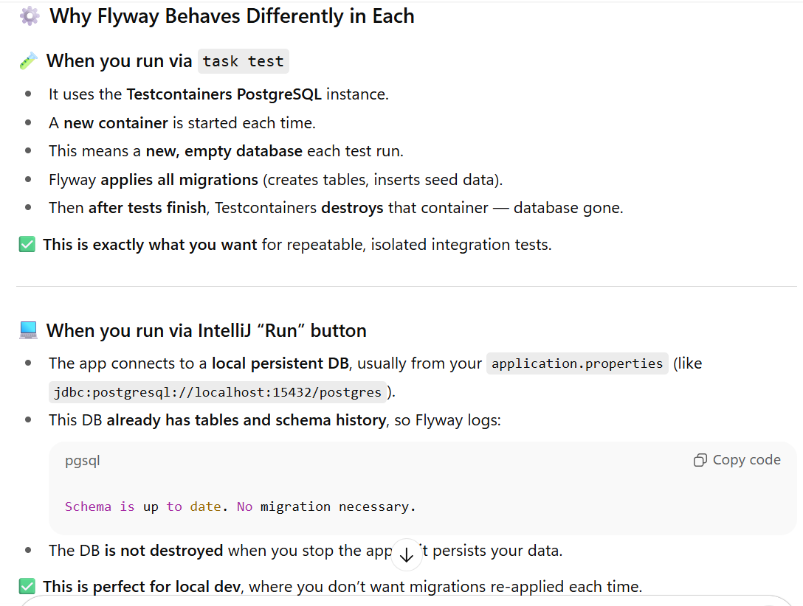

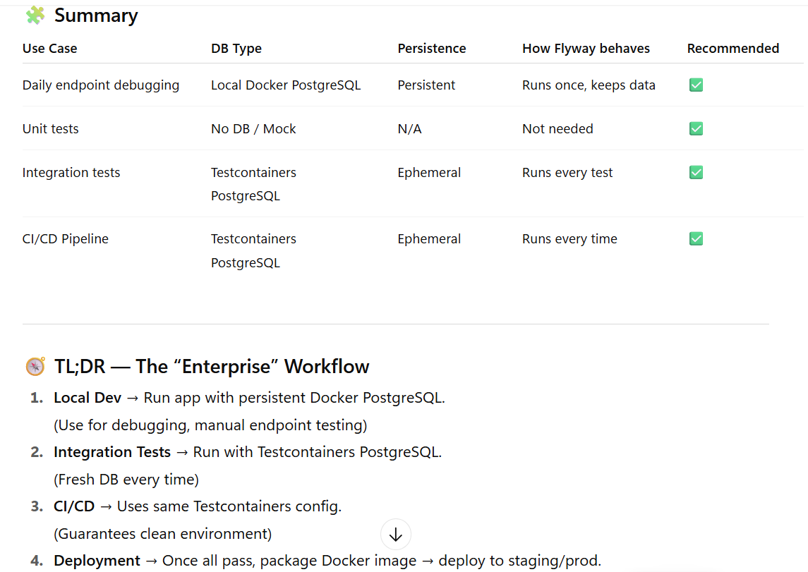

### Your ContainersConfig (the PostgreSQLContainer bean annotated with @ServiceConnection) is what makes the tests start and use a Testcontainers PostgreSQL instance (DB name test, random host port like 1339). The task test flow runs mvn clean verify (tests), which does not run your start_infra task, so the docker-compose DB (catalog-db on host port 15432, DB postgres) is not used by tests. When you run the app from IntelliJ the app uses your normal dev config (docker-compose DB on 15432) and therefore sees the persistent schema — Flyway skips migrations.

-@TestConfiguration(proxyBeanMethods = false)
-public class ContainersConfig {
-   @Bean
-   @ServiceConnection
-   PostgreSQLContainer<?> postgresContainer() {
- return new PostgreSQLContainer<>(DockerImageName.parse("postgres:16-alpine"));
-    }
-   }
### The @ServiceConnection marker (Spring Boot Testcontainers integration) tells Spring Boot: “this is a service container; please wire application service connections (like the DataSource) to it.”

- Result: Spring Boot test autoconfiguration will use that container’s JDBC URL/credentials for the test DataSource. Testcontainers will create an ephemeral database (default databaseName is test) and expose it on a random host port (your logs show jdbc:postgresql://localhost:1339/test).

### Your **task test** command only runs Maven tests:

- test:
- deps: [format]
- cmds:
- - "{{.MVN}} clean verify"

- It does not call start_infra. So the docker-compose DB (which your dev run uses) is not started/used by the tests.

- Therefore tests create their own ephemeral DB via Testcontainers — fresh schema each run → Flyway runs all migrations.

# Final recommendations (what I’d do as a Java architect)

- Keep Testcontainers for tests (isolation + CI friendliness). Don’t try to point tests to your dev DB.

- Use docker-compose for local dev (persisted DB on 15432) so you can inspect and iterate.

- If you need tests to be faster, consider shared container reuse (local-only) or reduce the amount of migrations in the test profile (e.g., a V1__test_data.sql small set).

- If you want tests to occasionally use the persistent DB, do it explicitly via a separate profile and a CI/dev task that starts infra first — but keep that separate from your normal mvn test flow.

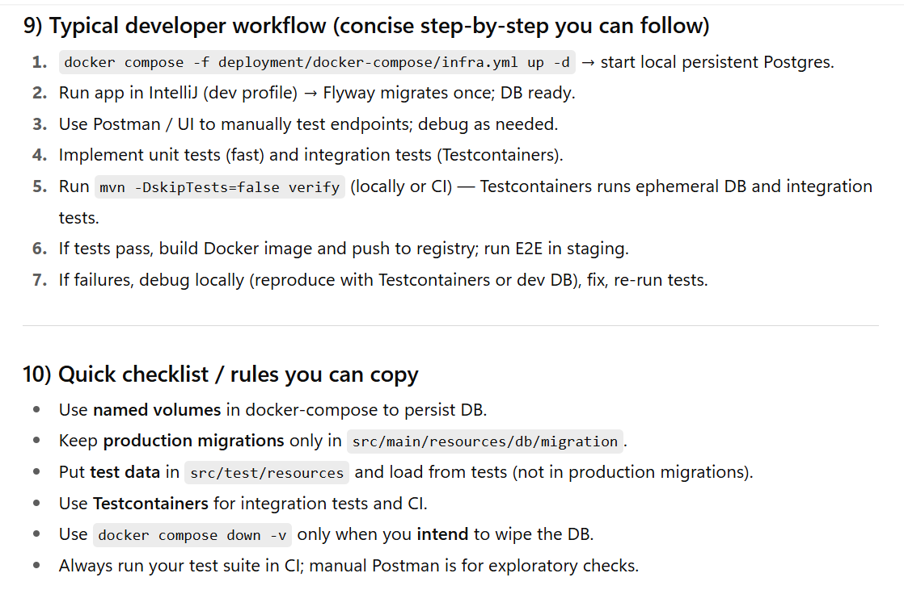
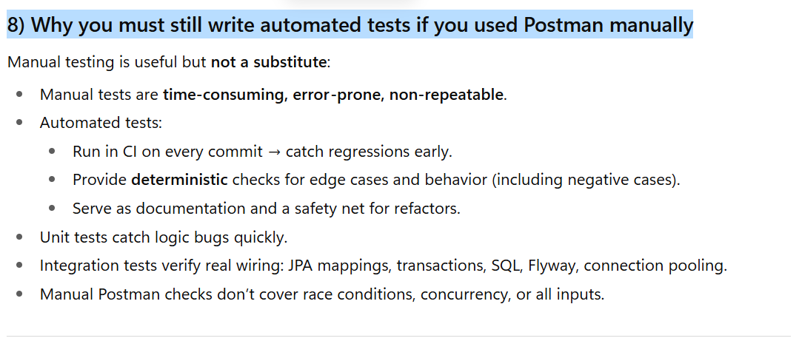
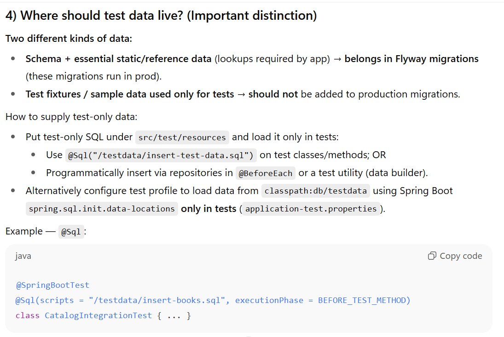  
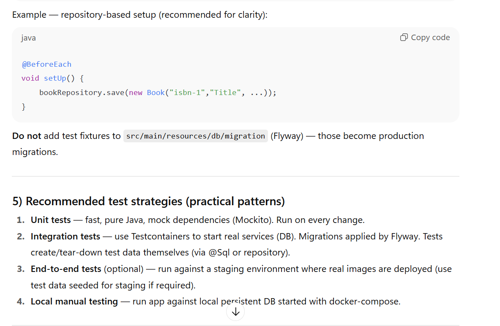
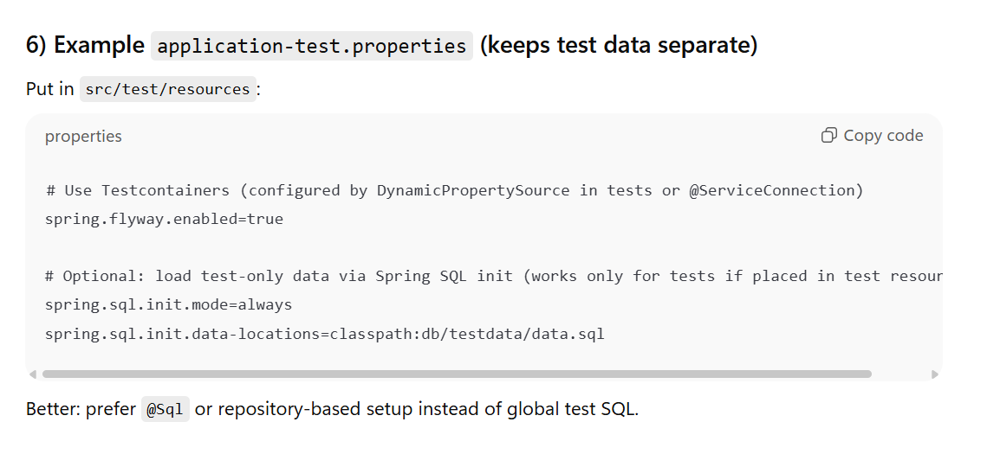

| Test                                  | Annotation / Tooling                                        | Server started? | DB real?                    |     Speed | Use case                                        |
| ------------------------------------- | ----------------------------------------------------------- | --------------- | --------------------------- | --------: | ----------------------------------------------- |
| Controller slice                      | `@WebMvcTest` + `MockMvc`                                   | No              | No (mock)                   | Very fast | Controller routing, validation, serialization   |
| Controller slice (RestAssuredMockMvc) | `RestAssuredMockMvc`                                        | No              | No                          | Very fast | Same as above, DSL style                        |
| Integration (full)                    | `@SpringBootTest(webEnvironment=RANDOM_PORT)` + RestAssured | Yes             | Optional (Testcontainers)   |      Slow | Full-stack verification (filters, security, DB) |
| Repository slice                      | `@DataJpaTest`                                              | No              | Optional via Testcontainers |    Medium | JPA mapping, custom repo queries                |
| Integration (HTTP)                    | `TestRestTemplate` or `HttpClient`                          | Yes             | Optional                    |      Slow | End-to-end HTTP flows                           |

| Aspect                                   | Pros                                                    | Cons                                                 |
| ---------------------------------------- | ------------------------------------------------------- | ---------------------------------------------------- |
| **`@TestConfiguration`**                 | Limits bean scope to tests, keeps prod context clean    | Needs explicit `@Import` if outside test package     |
| **`@Bean`**                              | Simple bean registration                                | Can conflict if multiple same-type beans exist       |
| **`@ServiceConnection`**                 | Auto-integration of Testcontainers (no manual registry) | Requires Spring Boot 3.1+                            |
| **Compared to `@DynamicPropertySource`** | Cleaner, automatic wiring                               | Less fine-grained control (if you need custom props) |

## 🏁 TL;DR

- What happens when your test starts:

- Spring loads ContainersConfig.

- It sees a @Bean returning a PostgreSQLContainer with @ServiceConnection.

- Boot automatically:

- starts the Postgres container;

- sets spring.datasource.* properties from it;

- creates your datasource connected to that container.

- Your tests run using the real Postgres DB in Docker, zero manual config.

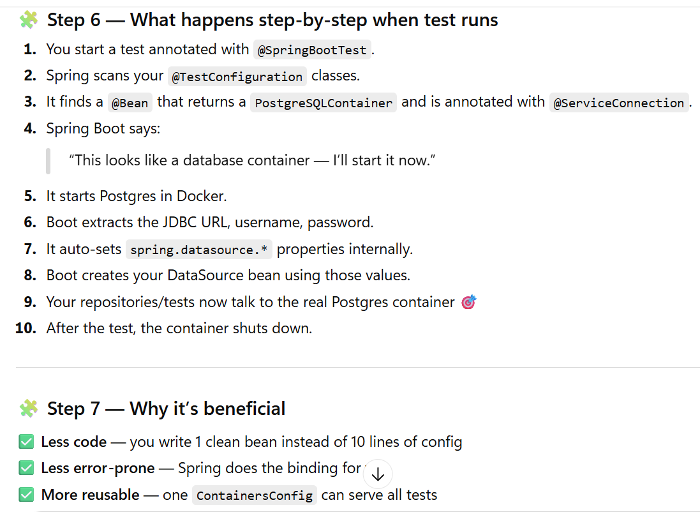

| Scenario                                                                         | Recommended Tool               | Why                                          |
| -------------------------------------------------------------------------------- | ------------------------------ | -------------------------------------------- |
| You want to **test only your service logic** and isolate from external calls     | ✅ Mockito / @MockBean          | Fast, no network calls                       |
| You want to **simulate an HTTP-based external service** with realistic responses | ✅ WireMock                     | Simulates a fake server; great for REST APIs |
| You want to **test real integration between microservices**                      | ✅ Testcontainers + RestAssured | Runs real containers or endpoints            |

| Tool                                   | Layer / Use Case        | Description                                                                       | Pros                        | Cons                           |
| -------------------------------------- | ----------------------- | --------------------------------------------------------------------------------- | --------------------------- | ------------------------------ |
| **MockMvc (@WebMvcTest)**              | Controller (slice test) | Tests MVC layer only (controllers, mapping, validation). Services & Repos mocked. | Fast, no full context       | Doesn’t hit real DB or network |
| **TestRestTemplate (@SpringBootTest)** | Full app test           | Starts real app (embedded server) and sends HTTP calls                            | Built-in, simple            | Verbose, less expressive       |
| **RestAssured (@SpringBootTest)**      | Full app test           | DSL for readable HTTP tests                                                       | Fluent, powerful assertions | Slight learning curve          |
| **HttpClient (Apache)**                | Low-level network       | Used rarely in tests                                                              | Flexible                    | Verbose, manual setup          |

| Situation                   | Recommended                          |
| --------------------------- | ------------------------------------ |
| Testing controllers (no DB) | `@WebMvcTest + MockMvc`              |
| Testing service + DB + API  | `@SpringBootTest + RestAssured`      |
| Simple end-to-end sanity    | `@SpringBootTest + TestRestTemplate` |
| External API mocking        | WireMock                             |

### Container Optimization for Tests
✅ When
- Large DBs or services make tests slow.

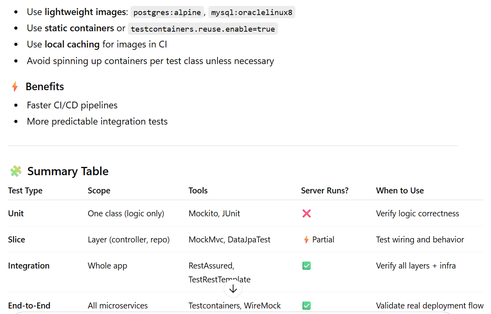
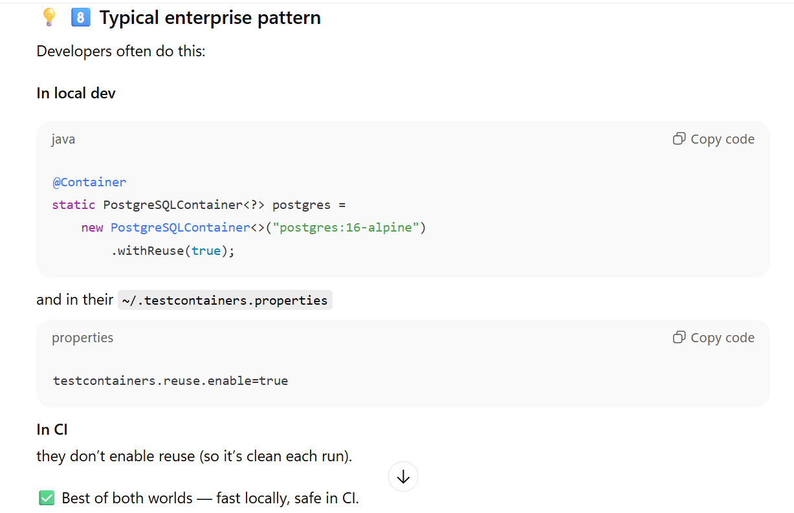

# 10) Quick checklist / rules of thumb

1. Want fast runs and can share DB state? Use shared container + rollback or cleanup → fewer starts.

1. Want fully isolated tests with clean DB each time? Use fresh containers per test or per-class (slower).

1. Use static @Container for per-JVM start (fast across classes).

1. Use .withReuse(true) for local dev speed; don’t enable in CI unless you understand implications.

1. Always prefer Flyway for schema and base migrations — versioned and production-like.

1. Unit tests: never use DB — use builders, mocks, and resource fixtures.

| Concept       | Implementation Type                    | Used For                                    | Typical Scope                 | Example                    | Replaces / Simulates                  |
| ------------- | -------------------------------------- | ------------------------------------------- | ----------------------------- | -------------------------- | ------------------------------------- |
| **Fake Bean** | Real class implementing same interface | Simulate internal service with simple logic | Integration / component tests | `FakePaymentService`       | Internal app service beans            |
| **@MockBean** | Mockito proxy created by Spring        | Replace bean with mock for unit isolation   | Unit / slice tests            | `@MockBean PaymentService` | Internal beans (but no real behavior) |
| **WireMock**  | Local HTTP server                      | Simulate 3rd-party API responses            | Integration / end-to-end      | `stubFor(get("/users"))`   | External REST services                |

# 1. SPRING BOOT APPLICATION — LIFECYCLE EXPLAINED SIMPLY

| Step | Stage                             | What Happens                                                                                      | How It Works Internally (simplified but interview-worthy)                                                                              |
| ---- | --------------------------------- | ------------------------------------------------------------------------------------------------- | -------------------------------------------------------------------------------------------------------------------------------------- |
| 1    | **Start Application**             | You run `SpringApplication.run(MyApp.class, args)`                                                | It creates a `SpringApplication` object and prepares the environment (profiles, properties, etc.)                                      |
| 2    | **Create Environment**            | Loads configs from `application.properties`, YAML, system vars, etc.                              | Uses `ConfigFileApplicationListener` to load files, merges profiles, etc.                                                              |
| 3    | **Create Application Context**    | Spring creates an `ApplicationContext` (like a container holding all beans)                       | For Boot apps, typically `AnnotationConfigServletWebServerApplicationContext` (web) or `AnnotationConfigApplicationContext` (non-web)  |
| 4    | **Class Scanning**                | Scans packages starting from your main class’s package (due to `@SpringBootApplication`)          | Internally uses `ClassPathScanningCandidateComponentProvider` to find all `@Component`, `@Service`, `@Repository`, `@Controller`, etc. |
| 5    | **Bean Definition Creation**      | Each found class becomes a **Bean Definition** (a plan, not yet an object)                        | Metadata stored about constructor, fields, dependencies, etc.                                                                          |
| 6    | **Bean Instantiation (Creation)** | Beans are created based on their definitions                                                      | Uses **reflection** to call constructors (no need to manually `new`)                                                                   |
| 7    | **Dependency Injection (Wiring)** | Spring injects other beans into fields/constructors marked with `@Autowired`, `@Inject`, etc.     | Uses reflection again to set fields or call constructor parameters                                                                     |
| 8    | **Post Processing**               | Special beans like `BeanPostProcessor`, `@Configuration`, `@Transactional`, `@Aspect` are handled | Spring enhances beans using **CGLIB proxies** or **AOP** (reflection + dynamic proxy)                                                  |
| 9    | **Context Refresh / Ready**       | Once all beans are created and wired → context is ready                                           | `ApplicationContext.refresh()` triggers all initialization listeners                                                                   |
| 10   | **Run Application**               | If you have `CommandLineRunner` or web app → starts Tomcat or Jetty                               | Web server started, endpoints exposed                                                                                                  |
| 11   | **Application Running**           | You can now call APIs, etc.                                                                       | Context stays alive until shutdown                                                                                                     |
| 12   | **Shutdown / Destroy Beans**      | When app stops, Spring calls `@PreDestroy` / `DisposableBean` methods                             | Gracefully destroys beans and releases resources                                                                                       |

# 2. SPRING BOOT TEST APPLICATION — LIFECYCLE

| Step | Stage                                | What Happens                                                                       | Difference from Normal App                              |
| ---- | ------------------------------------ | ---------------------------------------------------------------------------------- | ------------------------------------------------------- |
| 1    | **Test Runner Starts**               | JUnit or other test framework starts                                               | Uses `SpringRunner` or `SpringExtension`                |
| 2    | **Create Test Context**              | A special **TestApplicationContext** is created                                    | Managed by `Spring TestContext Framework`               |
| 3    | **Load Configuration**               | Reads your `@SpringBootTest(classes=...)`, `@TestConfiguration`, etc.              | Allows overriding beans for tests                       |
| 4    | **MockBeans Registered**             | Beans annotated with `@MockBean` or `@SpyBean` are created and injected            | Uses Mockito under the hood, replaces real beans        |
| 5    | **ApplicationContext Reuse**         | If another test uses same context config, it **reuses it** (cached)                | Huge speed optimization — doesn’t rebuild every time    |
| 6    | **Bean Scanning & Creation**         | Same scanning, but may **limit scope** (`@WebMvcTest` only loads controller layer) | Avoids loading DB, services, etc. unless mocked         |
| 7    | **Dependency Injection**             | Injects mocks and real beans as per need                                           | Reflection + same injection process                     |
| 8    | **Start Web Environment (Optional)** | If `webEnvironment` set, embedded server may start                                 | Often mocked unless you use full integration test       |
| 9    | **Run Tests**                        | Your test methods execute                                                          | Context already loaded; tests can call beans, endpoints |
| 10   | **Tear Down / Reuse**                | Context may be reused for next test with same config                               | Otherwise destroyed                                     |

# 3. KEY DIFFERENCES (TABLE SUMMARY)
| Feature / Phase          | Spring Boot App                                | Spring Boot Test App                          |
| ------------------------ | ---------------------------------------------- | --------------------------------------------- |
| **Entry Point**          | `main()` method with `SpringApplication.run()` | `@SpringBootTest` + JUnit runner              |
| **Context Type**         | `ApplicationContext` (for runtime)             | `TestApplicationContext` (for testing)        |
| **Bean Scanning**        | Full package scanning                          | Can be filtered (`@WebMvcTest`, etc.)         |
| **Dependency Injection** | Normal beans                                   | Can use `@MockBean`, `@SpyBean`, test configs |
| **Reflection Usage**     | Create + inject beans                          | Same, but also injects mock proxies           |
| **Environment**          | `application.properties` or YAML               | Merged with `application-test.properties`     |
| **Startup Time**         | Normal                                         | Cached/reused to be faster                    |
| **Server**               | Always starts (if web)                         | Optional or mock server                       |
| **Context Reuse**        | No reuse                                       | Yes (to speed up tests)                       |
| **End Goal**             | Run app for users                              | Test behavior of beans or controllers         |

# when to use what in Testing

| Scenario                 | Library                          | Example                                                 |
| ------------------------ | -------------------------------- | ------------------------------------------------------- |
| Validate simple logic    | **JUnit + AssertJ**              | `assertThat(sum).isEqualTo(5)`                          |
| Mock dependencies        | **Mockito**                      | `when(repo.find()).thenReturn(...)`                     |
| Verify service behavior  | **Mockito + AssertJ**            | `verify(repo).findByCode("P100")`                       |
| Test controller endpoint | **MockMvc + AssertJ/JSONAssert** | `mockMvc.perform(...).andExpect(status().isOk())`       |
| Full integration (DB)    | **Testcontainers + AssertJ**     | Real Postgres, `assertThat(repo.count()).isEqualTo(10)` |
| Async events             | **Awaitility + AssertJ**         | `await().untilAsserted(...);`                           |
| External API testing     | **RestAssured**                  | `given().get(...).then().statusCode(200)`               |

