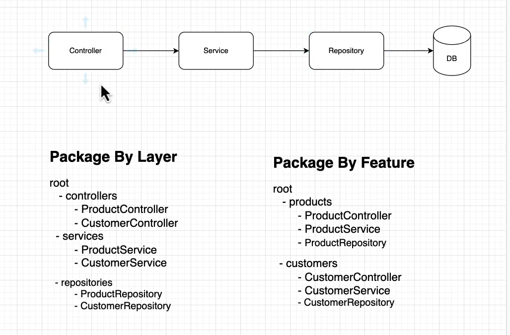
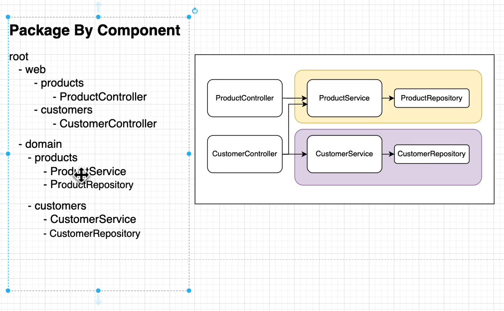
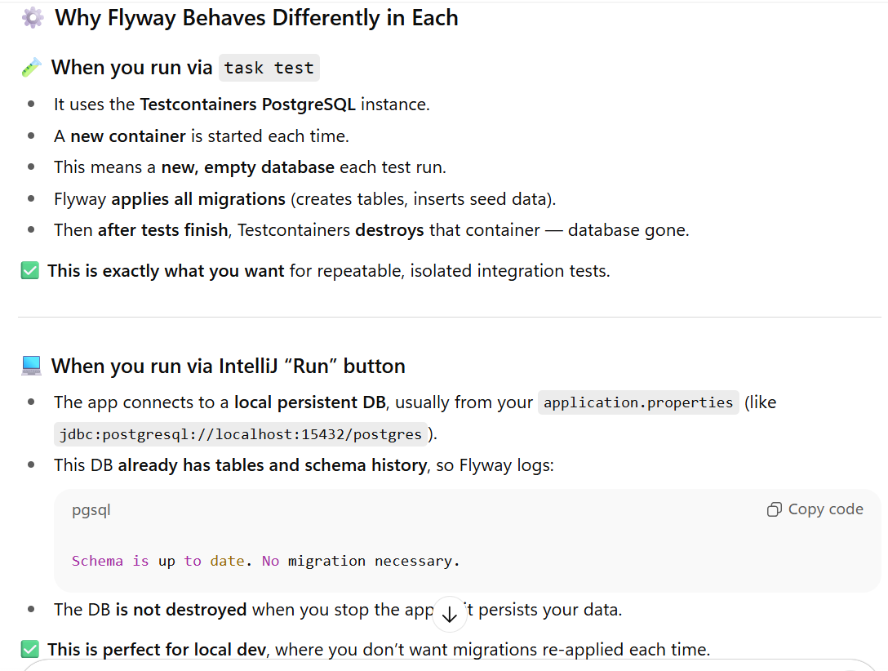
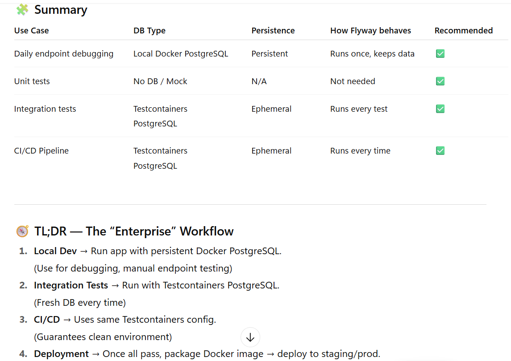

# spring-boot-microservices-course

spring-boot-microservices-course

# Database Configuration IN THE .PROPERTIES FILE  #
  
- spring.datasource.url=${DB_URL:jdbc:postgresql://localhost:15432/postgres}
- spring.datasource.username=${DB_USERNAME:postgres}
- spring.datasource.password=${DB_PASSWORD:postgres}
-
- These properties are only required for local debugging (e.g., hitting REST endpoints).
- They are NOT needed for code formatting, unit tests, or integration tests.
-
- Testcontainers automatically use the default credentials defined in infra.yml to
- connect the application to the database during local runs or debugging.
-
- Verified: Unit and integration tests do not require these properties,
- as the Spring Boot context does not load these configurations during the test phase.

# Pakaging type of java code
 

# Rules for Migration
- if we have put some **SQL** in the migration file and in the latter satge if 
- we want to **change anything** into that it will not work because it will make 
- the migration to fail due to the **checksum** value validation.

# Is it a good approach that tests and dev use different DBs?

- Yes — this is the intended, recommended approach in most projects:
- Tests: isolated, ephemeral DBs (Testcontainers) → deterministic CI, no test pollution.
- Dev: persistent DB (docker-compose) → you can inspect data, iterate, debug.
- Mixing them is risky: tests should be fully isolated from dev data.

### Your ContainersConfig (the PostgreSQLContainer bean annotated with @ServiceConnection) is what makes the tests start and use a Testcontainers PostgreSQL instance (DB name test, random host port like 1339). The task test flow runs mvn clean verify (tests), which does not run your start_infra task, so the docker-compose DB (catalog-db on host port 15432, DB postgres) is not used by tests. When you run the app from IntelliJ the app uses your normal dev config (docker-compose DB on 15432) and therefore sees the persistent schema — Flyway skips migrations.

-@TestConfiguration(proxyBeanMethods = false)
-public class ContainersConfig {
-   @Bean
-   @ServiceConnection
-   PostgreSQLContainer<?> postgresContainer() {
- return new PostgreSQLContainer<>(DockerImageName.parse("postgres:16-alpine"));
-    }
-   }
### The @ServiceConnection marker (Spring Boot Testcontainers integration) tells Spring Boot: “this is a service container; please wire application service connections (like the DataSource) to it.”

- Result: Spring Boot test autoconfiguration will use that container’s JDBC URL/credentials for the test DataSource. Testcontainers will create an ephemeral database (default databaseName is test) and expose it on a random host port (your logs show jdbc:postgresql://localhost:1339/test).

### Your **task test** command only runs Maven tests:

- test:
- deps: [format]
- cmds:
- - "{{.MVN}} clean verify"

- It does not call start_infra. So the docker-compose DB (which your dev run uses) is not started/used by the tests.

- Therefore tests create their own ephemeral DB via Testcontainers — fresh schema each run → Flyway runs all migrations.

# Final recommendations (what I’d do as a Java architect)

- Keep Testcontainers for tests (isolation + CI friendliness). Don’t try to point tests to your dev DB.

- Use docker-compose for local dev (persisted DB on 15432) so you can inspect and iterate.

- If you need tests to be faster, consider shared container reuse (local-only) or reduce the amount of migrations in the test profile (e.g., a V1__test_data.sql small set).

- If you want tests to occasionally use the persistent DB, do it explicitly via a separate profile and a CI/dev task that starts infra first — but keep that separate from your normal mvn test flow.

